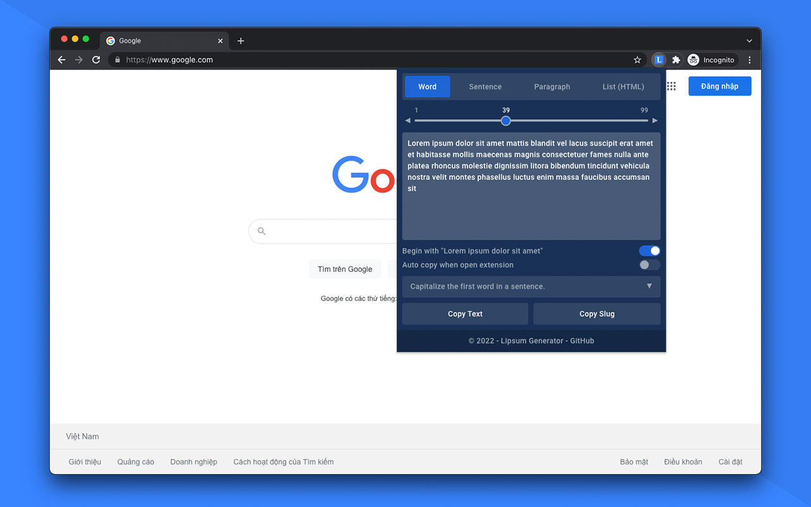
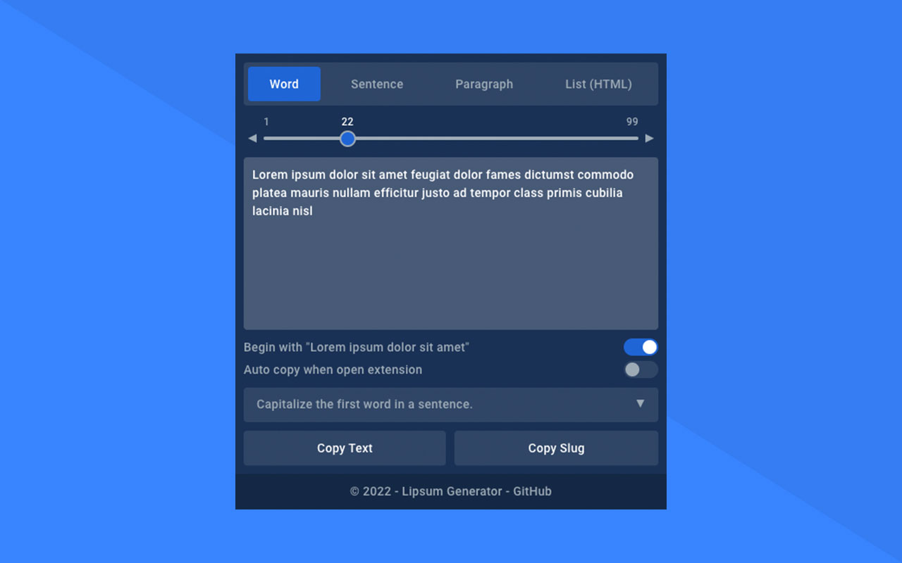
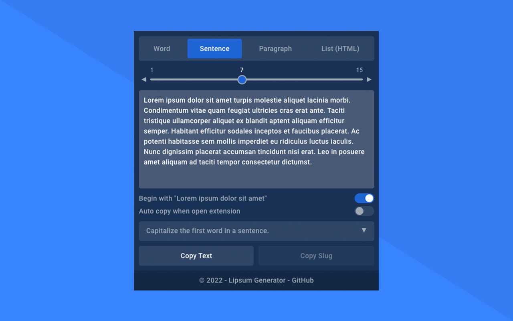
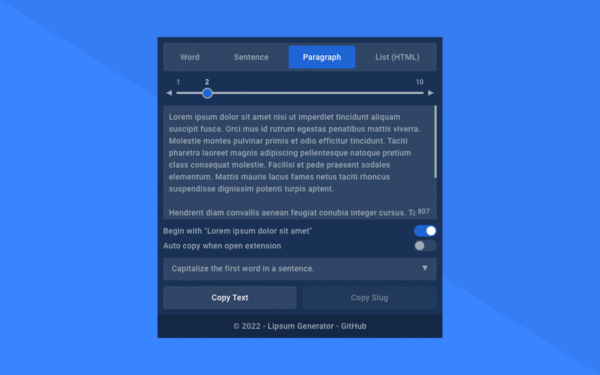
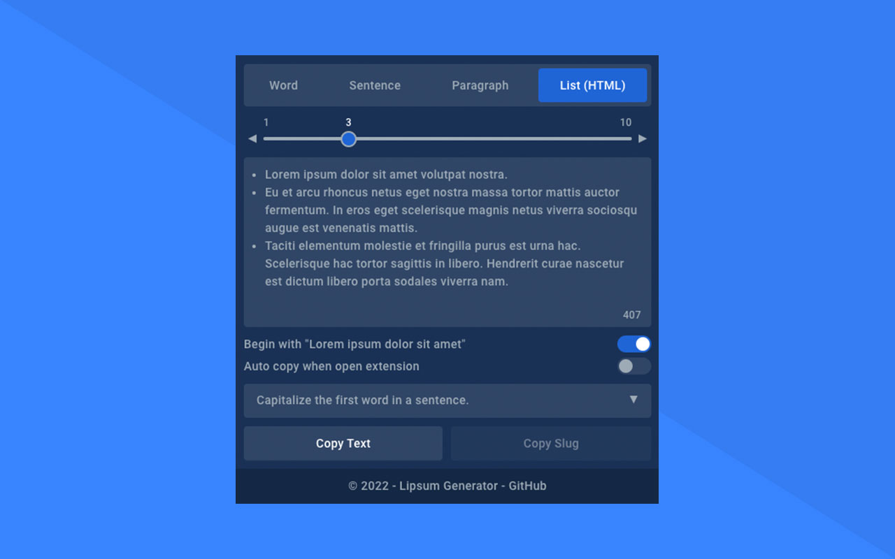
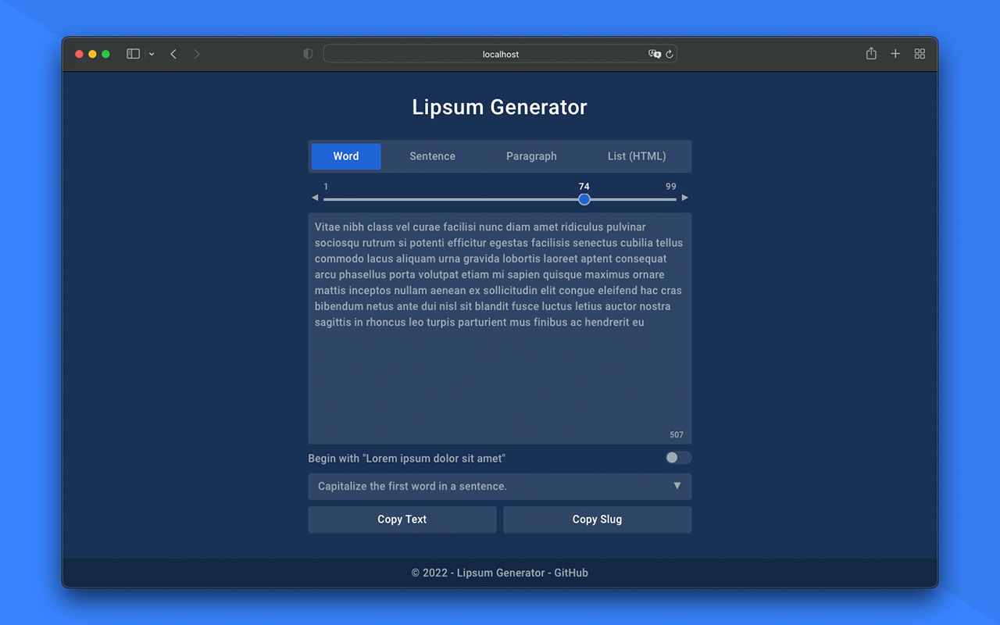

# Lipsum Generator v3.0.0 

[](https://github.com/phucbm/lipsum-generator/releases/latest)
[](https://github.com/phucbm/lipsum-generator/blob/main/LICENSE)
[](https://webuild.community)
[](https://app.netlify.com/sites/lipsum-generator/deploys)

<a href="https://www.producthunt.com/posts/lipsum-generator?utm_source=badge-featured&utm_medium=badge&utm_souce=badge-lipsum-generator" target="_blank"></a>

> Chrome Extension to generate lorem ipsum dummy text.

## Getting started

There are 2 versions of Lipsum Generator that you can choose according to your needs.

### 👉 **[Chrome Extension version](https://chrome.google.com/webstore/detail/lipsum-generator/fepopmflofkppphpkfjdbmimglkeifna)**







By using extension, you can have this tool works even when you're offline.

### 👉 **[Web version](https://lipsum-generator.netlify.app)**



The web version allows you to use on any browser, not just Chrome.

## Local deployment

```text
npm install
```

```text
gulp serve
```

## License

[MIT License](https://github.com/phucbm/lipsum-generator/blob/main/LICENSE)

Copyright (c) 2022 Minh-Phuc Bui
